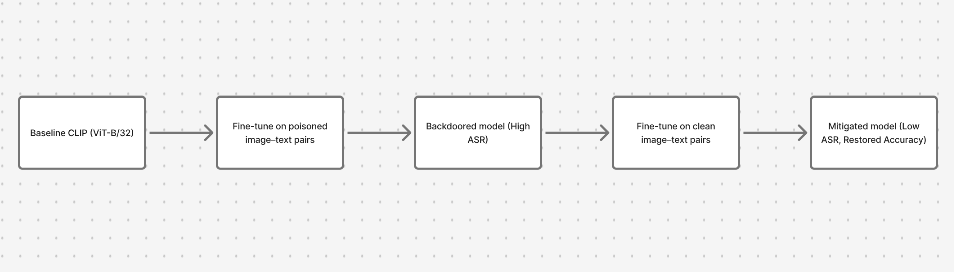

## Author 
Surankan De , Srinjoy Som 

## Usage
We recommend running the python file by
initially run `python3 final.py` or `python final.py`
`python3 final_cleanclip.py` or `python final_cleanclip.py` but `final_cleanclip.ipynb` and `final.ipynb` is provided, user can run that too

## Description

We have tried to implement Cleanclip , a method to get rid of backdoor attacks in clip ,  for that we have taken baseline clip vit b/32 model and then finetuned it for poisoning, after that used that model , and finetuned further on clean image text pairs and showed that the backdoor attacks can be removed , we focused on 2 main metrics accuracy->correct classifications and attack success rate (asr) -> backdoor attacks succesfully executed . Note , data changes everytime we run create dataset, so results might be different everytime, but more or less similar, if hyperparameters also are changed

## Flow

## Flow

